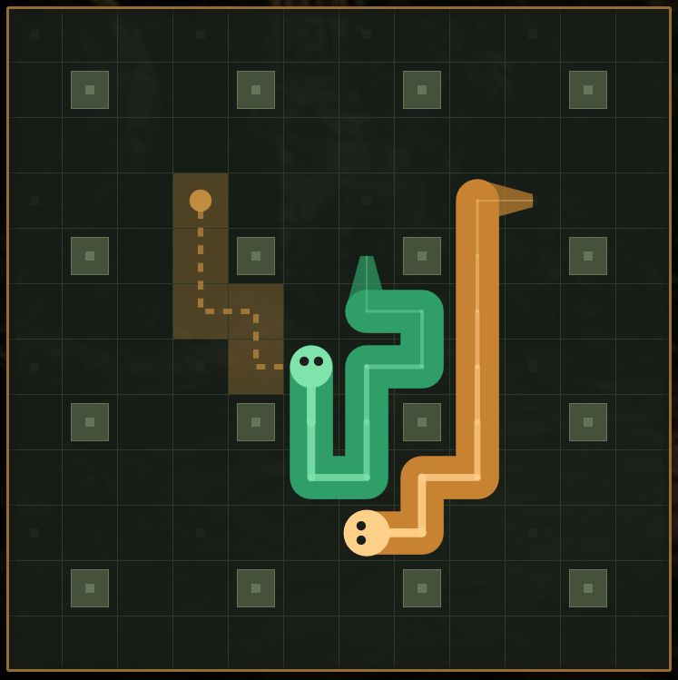
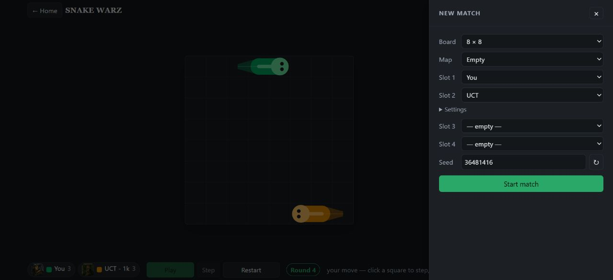

# Snake Warz

A fast, unforgiving Tron-style snake game. Every wall and trail is lethal, there is nothing to eat,
and the last snake moving wins.

## [▶ Play Snake Warz](https://alexoooo.github.io/snakewarz/)

No download or sign-in required. Play in a modern desktop or mobile browser.

[](https://alexoooo.github.io/snakewarz/)

## Play your way

- Take on the bots yourself with the keyboard, D-pad, mouse, or touch.
- Set up battles with two to four snakes on a variety of boards and maps.
- Pause, step through turns, replay finished matches, and share matches by URL.
- Run head-to-head or free-for-all tournaments directly in the browser.



## An AI playground too

Snake Warz includes bots ranging from simple reactive strategies to Monte Carlo tree search and
alpha-beta search. Matches are deterministic and bots use reproducible evaluation budgets, making
the game useful for comparing strategies as well as playing against them.

Want to explore or add a bot? Start with [the contributor guide](AGENTS.md) and
[the bot documentation](docs/Bots.md). The rest of the design and research notes live in
[`docs/`](docs).

## Run locally

With JDK 17–26 on `PATH`:

```bash
./gradlew :app:wasmJsBrowserDevelopmentRun
```

In PowerShell, use `.\gradlew.bat` instead of `./gradlew`.
